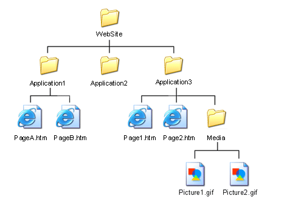

# Review
ICS3 - Mr. J 🐧
If you've been absent, you would benefit from catching up on the previous lessons.

- We have looked at the [structure of an HTML document](https://www.w3schools.com/html/html_intro.asp) and several tags:

```html
<!doctype html>, <head>, <body>
```

- [Various basic HTML tags](https://school.brash.ca/ics3/1/5) for things like text, tables, lists, and images.

- Most tags have lots of optional attributes.

- W3Schools and Google are your best friends for learning HTML!

## Part 1: Links (Hypertext)

The strongest aspect of webpages is interactivity and the ability to follow a link to another page.

A ["Hyperlink"](https://en.wikipedia.org/wiki/Hyperlink) was the first active tag created for HTML. It was originally known as an [anchor](https://www.w3.org/MarkUp/1995-archive/Elements/A.html) because it marks the end of your visit on the current page, leading to a new location.

The tag is `<a>Content to make hyper</a>` but it requires the `href` attribute. "Href" stands for "hyperlink reference" and it is the destination of the link.

### Example 1:
```html
<a href="www.snapchat.com">Click here to go to Snapchat</a>
```

Almost anything can be hyper or clickable.

### Example 2 - Make an image hyper:
```html
<a href="www.brash.ca">
  
</a>
```

The [anchor](https://www.w3schools.com/tags/tag_a.asp) tag can be used for linking to a heading inside your own page (called [bookmarks](https://www.w3schools.com/html/html_links_bookmarks.asp)), opening a link in a [new tab or window](https://www.w3schools.com/tags/att_a_target.asp), and a few other things.

## Part 2: Organization

Ever think of how many files are on Wikipedia.org or Amazon.ca? Keeping your files organized is very important.

Developers use folders and proper naming conventions to make their work easier. Let's look at a typical structure:



- The first page of your site must be in the root folder (lowest or main folder) and for default web servers, it must be named `index.html`.
- You can change the home page filename but the server would need to be configured to do so.
- Media should be separated into images and video, etc.
- Other HTML files should be organized in folders.
- Scripts and Style should also have their own "homes".
- Files should be named very descriptively and with a common look and feel. If you decide on using [camelCaseNaming](https://en.wikipedia.org/wiki/Camel_case) or [under_score_naming](https://en.wikipedia.org/wiki/Snake_case), it should be consistent.

## Practice Time!

We will keep using the same repo from 1.5:

- Create a folder for pages.
- Inside your new pages folder, create a new HTML file (following proper structure) called `history.html`.
- This new page is for historical information or facts about your topic.
- Be very careful - if this new page has pictures, you're going to need to [learn about file paths!](https://www.w3schools.com/html/html_filepaths.asp)
- Feel free to add as many pictures as you want but always store them in your images folder.
- Feel free to add as many extra pages as you want but always store them in your pages or html folder.
## Extra

- Entire list of HTML tags [by category](https://www.w3schools.com/tags/ref_byfunc.asp) and by [alphabet.](https://www.w3schools.com/tags/default.asp)
- [The HTML syntax guide.](https://www.w3schools.com/html/html5_syntax.asp)
- [The CSS Reference.](https://www.w3schools.com/cssref/index.php)
🐧
